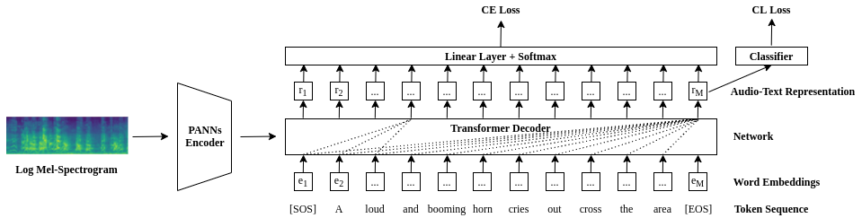

# CL4AC: A Contrastive Loss for Audio Captioning

This repository contains the code and generated sound samples of our paper *"<a href="https://arxiv.org/pdf/2107.09990.pdf">CL4AC: A Contrastive Loss for Audio Captioning</a>"*, which was accepted for the Detection and Classification Acoustic Scenes and Events (DCASE) Workshop 2021.
## Model architecture
We proposed a contrastive loss for audio captioning task.


## Set up environment

* Clone the repository: 

  ```
  git clone https://github.com/liuxubo717/contrastive_loss_for_audio_captioning
  ```

* Create conda environment with dependencies: 

  ```
  conda create -f environment.yml -n audio_captioning
  ```

* Activate conda environment:  

  ```
  conda activate audio_captioning
  ```

## Dataset
We use the *"<a href="https://github.com/audio-captioning/clotho-dataset">Clotho V2</a>"* dataset, the audio data has been processed to h5 file data format, and saved into the `data/logspectrogram` directory. Captions files are saved in `data/` directory.


## Training

The configuration files of training script are under the `config/` directory.

Then, execute the training script by:
 ```
  python train.py --config=config/w2v-trainable-selection-loss-last-hidden.yml --lr=0.0005 --batch=16
  ```
During training, the log of the `tensorboard` will be located under `runs/` directory, which will be created automatically after program started.

Meanwhile, the models for each epoch will be saved under the `saved_model` directory.

The evaluation will be automatic executed after each training epoch.


## Cite

If you use our code, please kindly cite following: 

```
@article{liu2021cl4ac,
  title={CL4AC: A Contrastive Loss for Audio Captioning},
  author={Liu, Xubo and Huang, Qiushi and Mei, Xinhao and Ko, Tom and Tang, H Lilian and Plumbley, Mark D and Wang, Wenwu},
  journal={Proceedings of the Detection and Classification of Acoustic Scenes and Events 2021 Workshop (DCASE 2021)},
  year={2021}
}
```